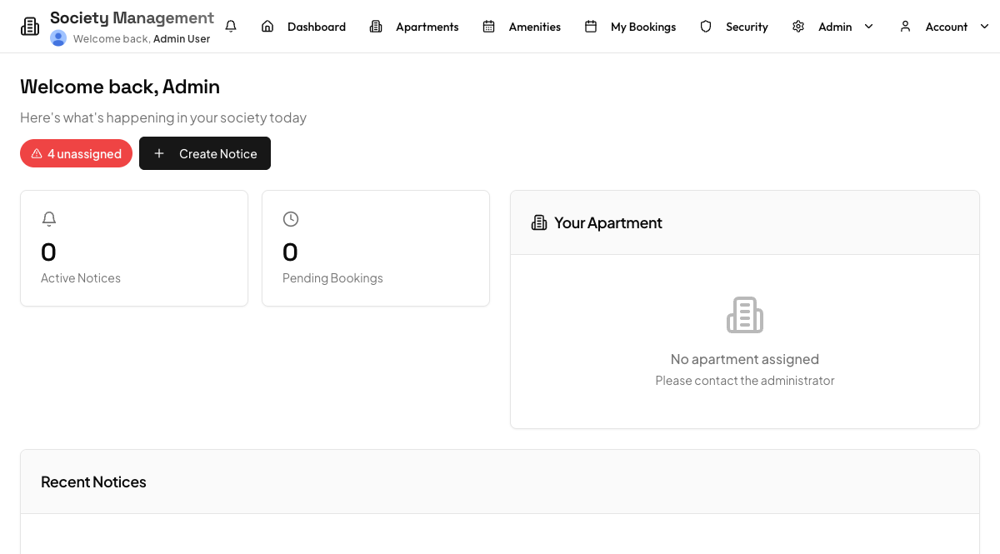
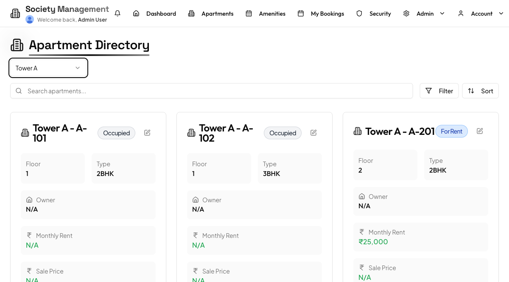
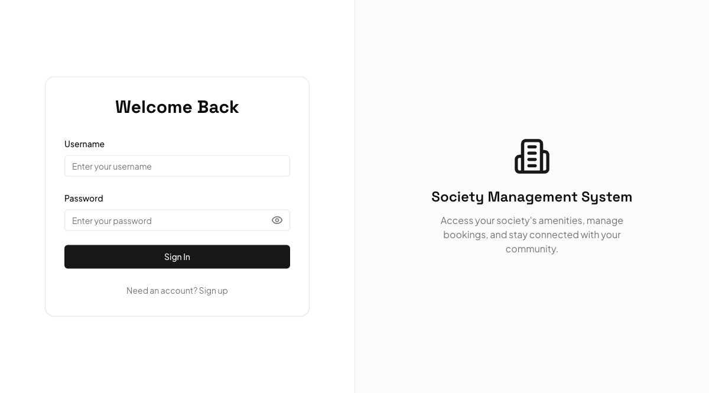

# Society Management

A residential society management system — apartment directory, amenity booking,
visitor and gate management, complaints, notices, and admin reporting.

React 18 + Vite on the front end, Express + Passport on the back, Drizzle ORM over
Postgres. Three roles (admin, resident, guard) gate both navigation and the API.

<p align="center">
  
</p>

<p align="center">
  
  
</p>

## Features

**Residents** browse the apartment directory, book amenities (gym, clubhouse, guest
house), pre-approve expected visitors, raise and track complaints, read notices, and
manage vehicles and notification preferences.

**Guards** check visitors in and out, work the pre-approval queue, and see who is
currently on the premises.

**Admins** manage users, towers and apartments, approve bookings, triage complaints,
publish notices, run reports, and manage data retention.

## Getting started

### Prerequisites

- Node 22 (`nvm use` reads `.nvmrc`)
- A Postgres database — Supabase works well

### Setup

```bash
git clone https://github.com/as656953/Society-management.git
cd Society-management
npm install

cp .env.example .env
# fill in DATABASE_URL and SESSION_SECRET
```

`.env.example` documents every variable, which are required, and which features
degrade without the optional ones. The two you must set:

- **`DATABASE_URL`** — on Supabase, use the **session pooler** string (port 5432)
  from Dashboard → Connect. Avoid the transaction pooler on 6543: the session store
  needs a persistent connection.
- **`SESSION_SECRET`** —
  ```bash
  node -e "console.log(require('crypto').randomBytes(32).toString('hex'))"
  ```

### Run

```bash
npm run db:migrate   # build the schema
npm run db:seed      # fill it with demo data and print the logins
npm run dev
```

API and Vite dev client on <http://localhost:3000>.

`db:seed` creates three towers, eighteen apartments, three amenities and one
account per role, then prints the credentials. It refuses to run against a
database that already contains users, so it cannot overwrite real data.

> `npm run db:push` is unsafe on an existing database and is kept only for
> reference. Use `db:migrate`. See [CLAUDE.md](CLAUDE.md).

## Commands

| Command | Purpose |
|---|---|
| `npm run dev` | Development server with hot reload |
| `npm run build` | Production build (client + bundled server) |
| `npm start` | Run the production build |
| `npm run check` | TypeScript type check |
| `npm run lint` | ESLint |
| `npm run format` | Prettier |
| `npm run db:migrate` | Apply migrations |
| `npm run db:seed` | Seed demo data (refuses if users exist) |

## Project structure

```
client/src/         React app
  pages/            17 route components
  components/ui/    shadcn/ui primitives
  hooks/            use-auth and friends
server/             Express API
  auth.ts           Passport strategies, scrypt hashing
  db.ts             Lazy pg pool + drizzle
  storage.ts        IStorage data-access layer
  routes/           Feature route modules
shared/schema.ts    Drizzle schema + zod validators (single source of truth)
api/index.ts        Vercel serverless entry
migrations/         SQL migrations
```

## Engineering notes

Things worth knowing, and the reasoning behind a few choices.

**Session auth over JWT.** The app is server-rendered-adjacent and same-origin, so
cookie sessions avoid shipping tokens to the client and give real server-side logout.
Sessions live in Postgres via `connect-pg-simple` locally. The tradeoff shows up on
serverless: the Vercel entry currently uses an in-memory store, so sessions do not
survive across instances. Moving it to the Postgres store is open work.

**Passwords are scrypt, not bcrypt.** `hash.salt`, 161 characters. Anything writing a
password must produce that exact shape or login fails silently.

**Two competing notions of admin.** A legacy `users.is_admin` boolean and a
`users.role` string coexist, and `isAdmin` is read inline in 66+ places across 12
files. Unifying them behind `requireRole()` middleware is planned, deliberately
*after* a role × endpoint test exists to catch regressions.

**The serverless ESM saga.** A long run of "Fix Vercel deployment" commits traces one
root cause: server code must use relative imports with explicit `.js` extensions, even
though the files are `.ts`. The `@shared/*` alias works in client code only. Vercel's
ESM resolution breaks otherwise.

**What a security review turned up.** The API was returning scrypt password hashes to
the browser on every auth check, and `server/index.ts` was logging full response
bodies, so the hashes were in the logs too. Row Level Security was disabled on every
table, leaving them readable through the public PostgREST API. A committed `.env` and
two database dumps containing real password hashes and phone numbers were public in
git history. RLS is now enabled, the history is purged, and the serializer work is in
progress. Full findings and the remediation plan live in [MEMORY.md](MEMORY.md).

## Contributing

Read [CLAUDE.md](CLAUDE.md) first — it documents the non-obvious traps, most
importantly the `.js` extension rule above and why `db:migrate` rather than
`db:push` is the supported way to change the schema.

[MEMORY.md](MEMORY.md) tracks project state, past decisions, and the backlog.

## License

MIT — see [LICENSE](LICENSE).
